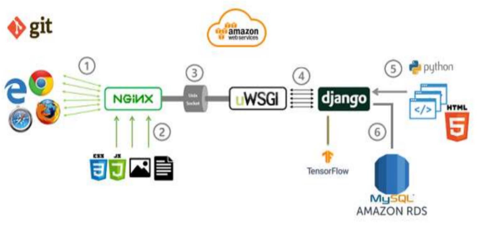
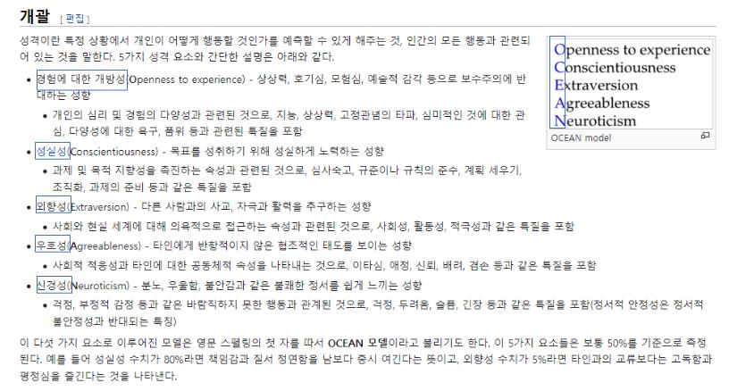
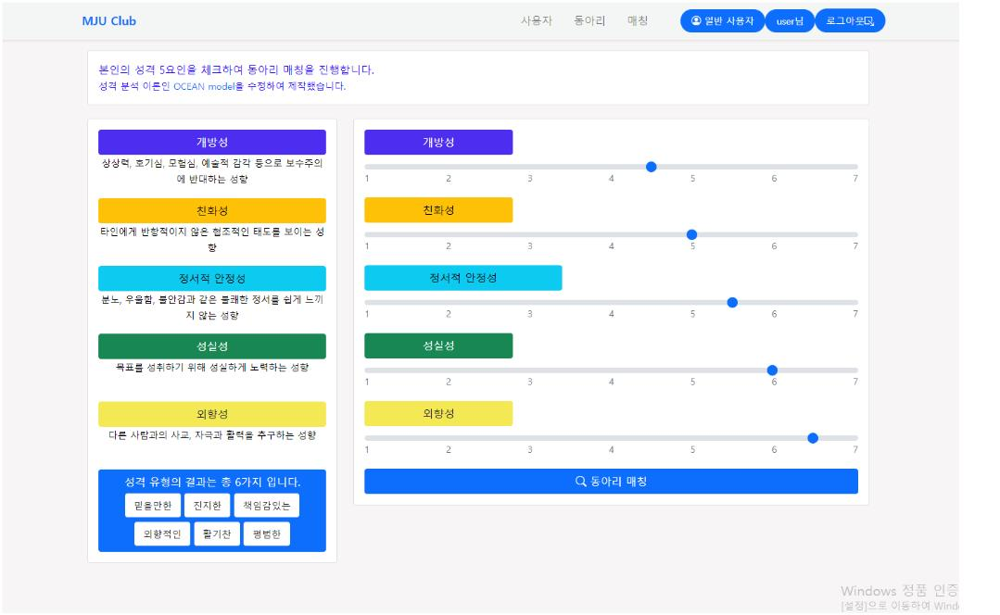
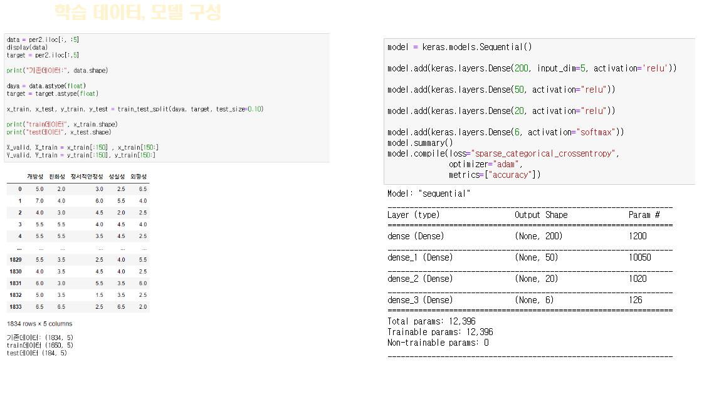
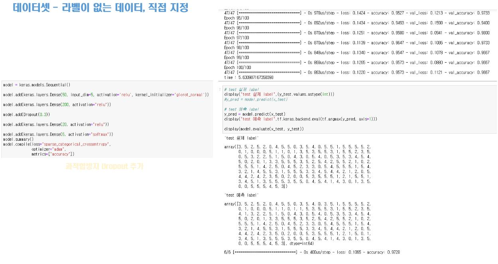

## 캡스톤디자인2 프로젝트

### 참여 인원: 2인

## 기술 스택

 

### 프로젝트 개요
동아리 가입을 원하는 사용자들은 다양한 동아리에 대한 정보를 제공합니다.  
사용자의 성격을 기반으로 동아리를 추천, 어떤 동아리에 가입할지에 대한 결정을 내리는 데 도움을 줍니다.  
이를 위해 매칭 기능을 도입하여 사용자의 성격과 동아리의 특성을 고려한 추천 리스트를 보여줍니다.  
사용자의 성격 유형과 어울릴 수 있는 동아리를 매칭하여, 보다 만족스러운 활동을 찾을 수 있도록 지원합니다.  
사용자 개개인의 특성과 성향을 고려하여 최적화된 동아리 경험을 제공하는 것을 목표로 하고 있습니다.

 

### 아키텍처

 

### 사용된 성격 유형 분류체계 OCEAN

 

### 프로젝트 결과

 

### DNN 구성

  

#### 실행시 필요한 작업

>pip install -r requirements.txt

#### 필요한 파일 (공개하지 않음)

>mysql.cnf 
>secrets.json

#### Model, Weight 경로

>app_match/modeldata

